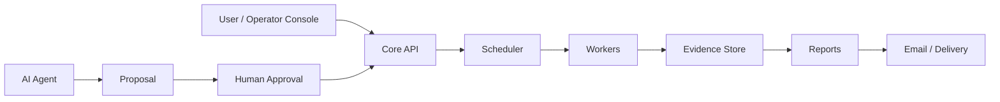

# EverForge Architecture

```mermaid
flowchart LR
    operator["User / Operator Console"] --> core["Core API"]
    core --> scheduler["Scheduler"]
    scheduler --> workers["Workers"]
    workers --> evidence["Evidence Store"]
    evidence --> reports["Reports"]
    reports --> delivery["Email / Delivery"]

    ai["AI Agent"] --> proposal["Proposal"]
    proposal --> approval["Human Approval"]
    approval --> core
```
