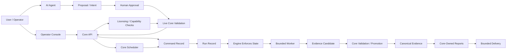

# EverForge Architecture

```mermaid
flowchart LR
    user["User / Operator"] --> console["Operator Console"]
    user --> agent["AI Agent"]

    agent --> proposal["Proposal / Intent"]
    proposal --> approval["Human Approval"]
    console --> core["Core API"]
    approval --> validation["Live Core Validation"]
    validation --> core

    core --> command["Command Record"]
    core --> scheduler["Core Scheduler"]
    scheduler --> command
    command --> run["Run Record"]
    run --> engine["Engine Enforces State"]
    engine --> worker["Bounded Worker"]
    worker --> candidate["Evidence Candidate"]
    candidate --> promotion["Core Validation / Promotion"]
    promotion --> evidence["Canonical Evidence"]
    evidence --> reports["Core-Owned Reports"]
    reports --> delivery["Bounded Delivery"]

    core --> licensing["Licensing / Capability Checks"]
    licensing --> validation
```
