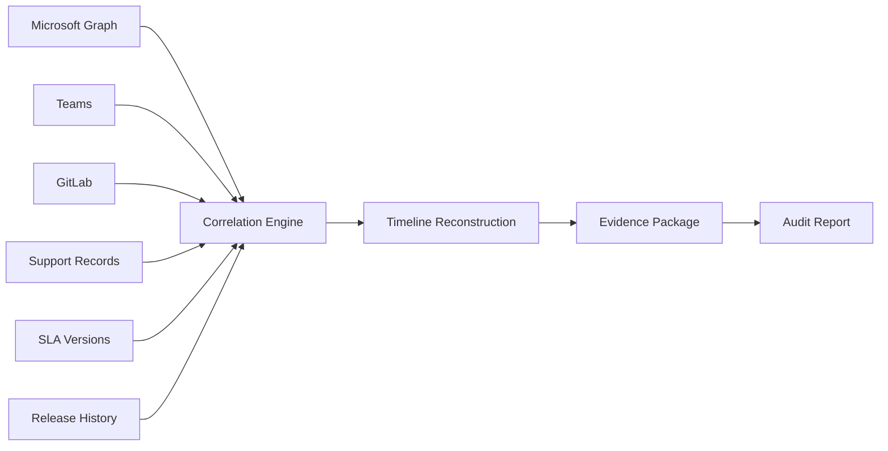

# Evidence Correlation Flow

```mermaid
flowchart LR
    msgraph["Microsoft Graph"] --> corrEngine["Correlation Engine"]
    teamsSource["Teams"] --> corrEngine
    gitlabSource["GitLab"] --> corrEngine
    supportRecords["Support Records"] --> corrEngine
    slaVersions["SLA Versions"] --> corrEngine
    releaseHistory["Release History"] --> corrEngine

    corrEngine --> timeline["Timeline Reconstruction"]
    timeline --> evidencePackage["Evidence Package"]
    evidencePackage --> auditReport["Audit Report"]
```
