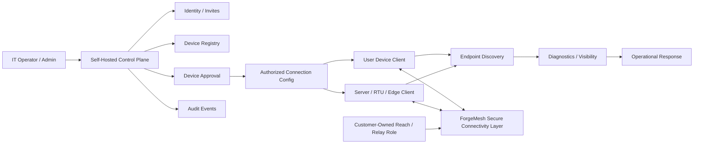

# ForgeMesh Connectivity Flow

```mermaid
flowchart LR
    admin["IT Operator / Admin"] --> control["Self-Hosted Control Plane"]
    control --> identity["Identity / Invites"]
    control --> registry["Device Registry"]
    control --> approval["Device Approval"]
    control --> audit["Audit Events"]
    approval --> config["Authorized Connection Config"]
    config --> clientA["User Device Client"]
    config --> clientB["Server / RTU / Edge Client"]
    clientA --> discovery["Endpoint Discovery"]
    clientB --> discovery
    discovery --> diagnostics["Diagnostics / Visibility"]
    clientA <--> mesh["ForgeMesh Secure Connectivity Layer"]
    clientB <--> mesh
    reach["Customer-Owned Reach / Relay Role"] --> mesh
    diagnostics --> response["Operational Response"]
```