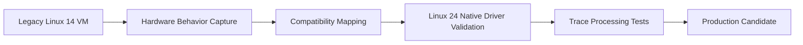

# Kernel Compatibility Flow

```mermaid
flowchart LR
    legacy["Legacy Linux 14 VM"] --> capture["Hardware Behavior Capture"]
    capture --> mapping["Compatibility Mapping"]
    mapping --> validation["Linux 24 Native Driver Validation"]
    validation --> tests["Trace Processing Tests"]
    tests --> candidate["Production Candidate"]
```
